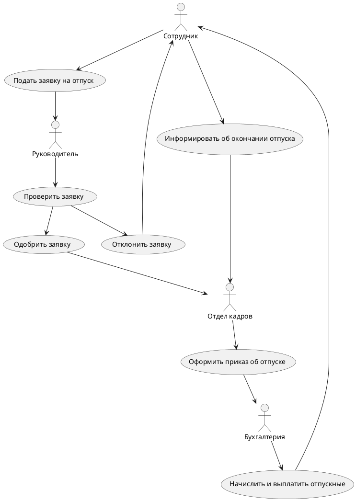
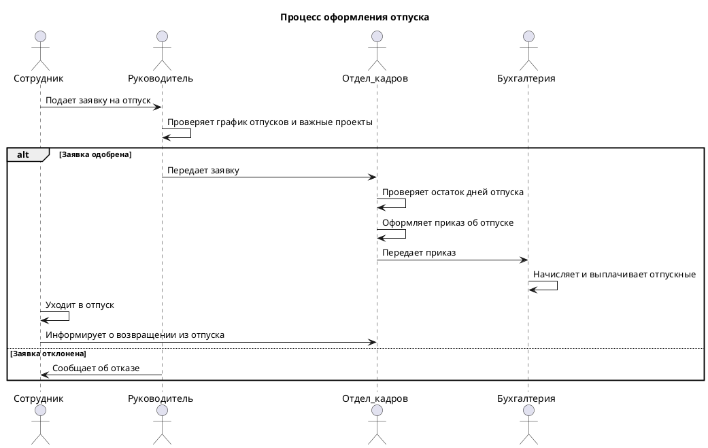

# Условие

Выберите простой бизнес-процесс, для примера можно   "Оформление заказа в интернет-магазине".  
  
Постройте базовую диаграмму бизнес-процесса с использованием BPMN.  
  
Постройте диаграмму прецедентов (use case) и последовательностей (sequence) . Используйте несколько простых актеров, таких как "Пользователь" и "Система".  
  
Можете ознакомится с инструментом для прототипирования Figma , попробовать сделать скетч/ вайерфрейм  /мокап/интерактивный мокап.

---
# Описание рассматриваемого бизнес-процесса

Процесс обработки заявки на отпуск сотрудника в компании.

Вот как он может выглядеть:
1. Сотрудник подает заявку на отпуск своему руководителю.
2. Руководитель проверяет, есть ли свободные дни в графике отпусков и не пересекается ли заявка с важными проектами.
3. Если заявка одобрена, руководитель передает ее в отдел кадров.
4. Отдел кадров проверяет остаток дней отпуска у сотрудника и оформляет приказ об отпуске.
5. Приказ об отпуске передается в бухгалтерию для начисления отпускных.
6. Бухгалтерия начисляет и выплачивает отпускные сотруднику.
7. Сотрудник уходит в отпуск.
8. По возвращении из отпуска сотрудник информирует отдел кадров.

---
# BPMN

**BPMN** - описывает условные обозначения и их описание в XML для отображения бизнес-процессов в виде диаграмм бизнес-процессов. BPMN ориентирована как на технических специалистов, так и на бизнес-пользователей. Для этого язык использует базовый набор интуитивно понятных элементов, которые позволяют определять сложные семантические конструкции. Кроме того, спецификация BPMN определяет, как диаграммы, описывающие бизнес-процесс, могут быть трансформированы в исполняемые модели.

![[2.svg]]

---
# Use Cases

**Диаграмма прецедентов или диаграмма вариантов использования (use case diagram)** в UML — диаграмма, отражающая отношения между акторами и прецедентами и являющаяся составной частью _**модели прецедентов**_, позволяющей описать систему на концептуальном уровне.

Прецедент — возможность моделируемой системы (часть её функциональности), благодаря которой пользователь может получить конкретный, измеримый и нужный ему результат. Прецедент соответствует отдельному сервису системы, определяет один из вариантов её использования и описывает типичный способ взаимодействия пользователя с системой. Варианты использования обычно применяются для спецификации внешних требований к системе.

![[1.svg]]

---
# Диаграмма последовательностей

**Диаграмма последовательности** _(sequence diagram)_ — UML-диаграмма, на которой для некоторого набора объектов на единой временной оси показан жизненный цикл объекта (создание-деятельность-уничтожение некой сущности) и взаимодействие акторов (действующих лиц) информационной системы в рамках прецедента.

Основными элементами диаграммы последовательности являются обозначения объектов. "Объект (программирование)") (прямоугольники с названиями объектов), вертикальные «линии жизни» (lifeline), отображающие течение времени, прямоугольники, отражающие деятельность объекта или исполнение им определенной функции (прямоугольники на пунктирной «линии жизни» — фокусы контроля, англ. _focus of control_), и стрелки, показывающие обмен сигналами или сообщениями между объектами.

![[3.svg]]

