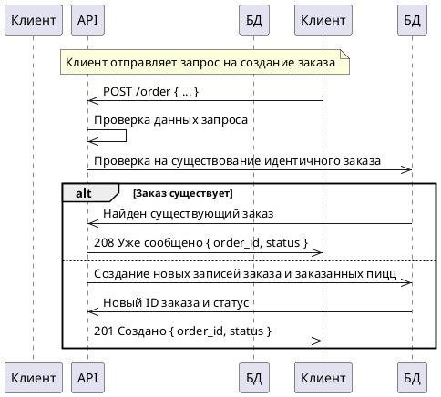

# Условие

Разработать и задокументировать REST API для веб-приложения Пиццерия  
  
Требования:  
1.  Разработать метод для создания заказа на бэке.   
2.  Метод отправляет информацию о заказе по нажатию кнопки пользователем. (Пользователь нажимает на кнопку "создать заказ (или аналогичную)". На бэке создается экземпляр сущности "заказ".)  
3.  Метод должен быть идемпотентным, должна быть описана логика ретраев.

---
# Документирование

В качестве спецификации описания запросов будет использоваться OpenAPI. Спецификация будет иметь следующий вид:

```yaml
openapi: 3.0.0
info:
  title: Pizza API
  version: 1.0.0

paths:
  /menu:
    get:
      summary: Отображение меню и работа функции комбо-пиццы
      responses:
        '200':
          description: Успешный ответ
          content:
            application/json:    
              schema:
                type: array
                items:
                  $ref: '#/components/schemas/Pizza'

  /order:
    post:
      summary: Отправка запроса на создание заказа
      requestBody:
        required: true
        content:
          application/json:
            schema:
              $ref: '#/components/schemas/OrderRequest'
      responses:
        '100':
          description: Перенаправление на систему оплаты
          content:
            application/json:    
              schema:
                type: object
                properties:
                  order_id:
                    type: string
                  url:
                    type: string
                  total_price:
                    type: string
        '102':
          description: Обработка запроса на создание заказа
          content:
            application/json:
              schema:
                type: object
                properties:
                  order_id:
                    type: string
                  status:
                    type: string
        '201':
          description: Заказ создан
          content:
            application/json:    
              schema:
                $ref: '#/components/schemas/OrderResponse'
        '204':
          description: Нет содержимого
          content:
            application/json:
              schema:
                type: object
                properties:
                  order_id:
                    type: string
        '206':
          description: Частичное содержимое
          content:
            application/json:
              schema:
                type: object
                properties:
                  order_id:
                    type: string
                  fields:
                    type: array
                    items:
                      type: string
        '208':
          description: Уже сообщалось
          content:
            application/json:    
              schema:
                $ref: '#/components/schemas/OrderResponse'
        '400':
          description: Неверный запрос. Пожалуйста, проверьте формат или содержание вашего запроса.
          content:
            application/json:
              schema:
                type: object
                properties:
                  error:
                    type: string
                    example: "Неверный формат данных. Пожалуйста, проверьте структуру запроса."
                  details:
                    type: string
                    example: "Отсутствует обязательное поле 'customer_name'."
        '401':
          description: Неавторизован. Требуется аутентификация для выполнения этого запроса.
          content:
            application/json:
              schema:
                type: object
                properties:
                  error:
                    type: string
                    example: "Доступ запрещен. Пожалуйста, предоставьте действительный токен аутентификации."
        '403':
          description: Доступ к указанному ресурсу запрещен.
          content:
            application/json:
              schema:
                type: object
                properties:
                  error:
                    type: string
                    example: "У вас нет прав для доступа к этому ресурсу."
        '404':
          description: Запрашиваемый ресурс не найден.
          content:
            application/json:
              schema:
                type: object
                properties:
                  error:
                    type: string
                    example: "Ресурс с указанным идентификатором не найден."
        '409':
          description: Конфликт данных. Запрос не может быть выполнен из-за конфликта с текущим состоянием ресурса.
          content:
            application/json:
              schema:
                type: object
                properties:
                  error:
                    type: string
                    example: "Конфликт с текущим состоянием заказа. Пожалуйста, попробуйте снова."
        '500':
          description: Внутренняя ошибка сервера. Что-то пошло не так.
          content:
            application/json:
              schema:
                type: object
                properties:
                  error:
                    type: string
                    example: "Произошла ошибка на сервере. Пожалуйста, попробуйте позже."
        '502':
          description: Плохой шлюз. Сервер получил недействительный ответ от вышестоящего сервера.
          content:
            application/json:
              schema:
                type: object
                properties:
                  error:
                    type: string
                    example: "Проблема с шлюзом. Пожалуйста, попробуйте позже."
        '503':
          description: Сервис временно недоступен. Сервер перегружен или в обслуживании.
          content:
            application/json:
              schema:
                type: object
                properties:
                  error:
                    type: string
                    example: "Сервис временно недоступен. Пожалуйста, попробуйте позже."
        '504':
          description: Таймаут шлюза. Сервер не получил своевременного ответа от вышестоящего сервера.
          content:
            application/json:
              schema:
                type: object
                properties:
                  error:
                    type: string
                    example: "Таймаут шлюза. Пожалуйста, попробуйте позже."

components:
  schemas:
    Pizza:
      type: object
      properties:
        id:
          type: integer
        name:
          type: string
        description:
          type: string
        ingredients:
          type: string
        price:
          type: number
        combo_price:
          type: number
          nullable: true
        image_url:
          type: string

    ComboPizza:
      type: object
      properties:
        id:
          type: string
        quantity:
          type: integer

    OrderRequest:
      type: object
      properties:
        customer_name:
          type: string
        delivery_address:
          type: string
          nullable: true
        phone_number:
          type: string
        desired_time_delivery:
          type: string
          format: date-time
        combo_pizzas:
          type: array
          items:
            $ref: '#/components/schemas/ComboPizza'
        total_price:
          type: number
        payment_type:
          type: integer

    OrderResponse:
      type: object
      properties:
        order_id:
          type: string
        status:
          type: string
        estimated_delivery_time:
          type: string
          format: date-time
        total_price:
          type: number
```

В методе `GET` для примера указан лишь один ответ 200, т.к. его описание не является условием данного задания. Ответы сервера на запрос `OrderRequest` будут следующими:

## 100 - Перенаправление на систему оплаты

Если клиент указал оплату онлайн, то бекенд сообщает клиент открыть систему оплаты, передавая сгенерированный URL.

```json
{
  "order_id": "string",
  "url": "string",
  "total_price": "string"
}
```

## 102 - Обработка запроса на создание заказа

Сервер сообщает клиенту, что заказ в очереди на обработку.

```json
{
  "order_id": "string",
  "status": "string"
}
```
## 201 - успешный ответ

Сервер сообщает, что заказ успешно создан и возвращает данные клиенту обратно для отображения.

```json
{
  "order_id": "string",
  "status": "string",
  "estimated_delivery_time": "2024-07-17T08:00:11.892Z",
  "total_price": 0
}
```

## 206 - Частичное содержимое

По какой-то причине сервер получил данные от клиента частично. Сервер возвращает незаполненные поля, чтобы клиент мог обработать их.

```json
{
  "order_id": "string",
  "fields": [
    "string"
  ]
}
```

## 208 - Уже сообщалось

Запрос на создание заказа был отправлен повторно. Сервер нашёл соотвтетствие и указал на это клиенту.

```json
{
  "order_id": "string",
  "status": "string",
  "estimated_delivery_time": "2024-07-17T08:00:11.892Z",
  "total_price": 0
}
```

## 400 - Неверный запрос. Пожалуйста, проверьте формат или содержание вашего запрос.

По какой-то причине на сервер был отправлен запрос не верного формата.

```json
{
  "error": "Неверный формат данных. Пожалуйста, проверьте структуру запроса.",
  "details": "Отсутствует обязательное поле 'customer_name'."
}
```

## 401 - Неавторизован. Требуется аутентификация для выполнения этого запроса.

По какой-то причине запрос был передан без токена аунтентификации.

```json
{
  "error": "Доступ запрещен. Пожалуйста, предоставьте действительный токен аутентификации."
}
```

## 403 - Доступ к указанному ресурсу запрещен.

Сервер временно закрыл обработку запросов по данному URI.

```json
{
  "error": "У вас нет прав для доступа к этому ресурсу."
}
```

## 404 - Запрашиваемый ресурс не найден.

```json
{
  "error": "Ресурс с указанным идентификатором не найден."
}
```

## 409 - Конфликт данных. Запрос не может быть выполнен из-за конфликта с текущим состоянием ресурса.

```json
{
  "error": "Конфликт с текущим состоянием заказа. Пожалуйста, попробуйте снова."
}
```

## 500 - Внутренняя ошибка сервера

Сервер столкнулся с неожиданной ситуацией, которая помешала ему выполнить запрос.

```json
{
  "error": "Произошла ошибка на сервере. Пожалуйста, попробуйте позже."
}
```

## 502 - Плохой шлюз

Сервер, работающий в качестве шлюза или прокси, получил недействительный ответ от вышестоящего сервера, на который он пытался получить доступ для выполнения запроса.

```json
{
  "error": "Проблема с шлюзом. Пожалуйста, попробуйте позже."
}
```

## 503 - Сервис временно недоступен

Сервер в настоящее время не может обработать запрос из-за временной перегрузки или техническое обслуживание системы.

```json
{
  "error": "Сервис временно недоступен. Пожалуйста, попробуйте позже."
}
```

## 504 - Таймаут шлюза

Сервер, работающий в качестве шлюза или прокси, не получил своевременного ответа от вышестоящего сервера, указанного путем URI обработки запроса.

```json
{
  "error": "Таймаут шлюза. Пожалуйста, попробуйте позже."
}
```

---
# Описание метода

**Наименование и описание:** `create_order` - Создание нового заказа на основе переданных данных.

**URI и метод:** `POST /order`

**Заголовки:**

- `Content-Type: application/json` (обязательный)

## Структура тела запроса:

```json
{
  "customer_name": "Джо Гарфилж",
  "delivery_address": "ул. Пушкина, д. 1",
  "phone_number": "+1234567890",
  "desired_time_delivery": "2023-03-15T18:00:00Z",
  "combo_pizzas": [
    {"id": "pizza-1", "quantity": 2},
    {"id": "pizza-2", "quantity": 1}
  ],
  "total_price": 39.99,
  "payment_type": 1
}
```

## Алгоритм обработки запроса:

1. **Валидация входных данных**:  
    * Проверка обязательных полей (`customer_name`, `phone_number`, `combo_pizzas`, `total_price`, `payment_type`).  
    * Валидация формата `desired_time_delivery` (ISO 8601 datetime).  
    * Проверка корректности `combo_pizzas` (существование пицц, количеств > 0).
2. **Идемпотентность**:  
    * Поиск существующего заказа с идентичными данными (customer, address, phone, pizzas, total_price, payment_type).  
    * Если найден, вернуть соответствующий ответ 208.
3. **Создание заказа**:  
    * Создание новой сущности `Order` в БД с полученными данными.  
    * Генерация уникального `order_id`.
4. **Ответ**:  
    * **201 Created**:  
    + Тело ответа: `{ "order_id": "<generated_id>", "status": "pending" }`.  
    * **208 Already Reported** (идемпотентность):  
    + Тело ответа: `{ "order_id": "<existing_id>", "status": "<existing_status>" }`.  
    * **400 Bad Request** (невалидные данные или логические ошибки):  
    + Тело ответа: `{ "error": "Invalid request", "details": ["<specific_error_messages>"] }`.

## Маппинг на БД:

- Таблица `orders`:  
    + `id` (primary key, autoincrement)  
    + `customer_name`  
    + `delivery_address`  
    + `phone_number`  
    + `desired_time_delivery` (datetime)  
    + `total_price`  
    + `payment_type`  
    + `status` (enum: pending, processing, delivered, cancelled)
- Таблица `order_pizzas` (many-to-many):  
    + `order_id` (foreign key to `orders.id`)  
    + `pizza_id` (foreign key to `pizzas.id`)  
    + `quantity`

## Диаграмма последовательности

