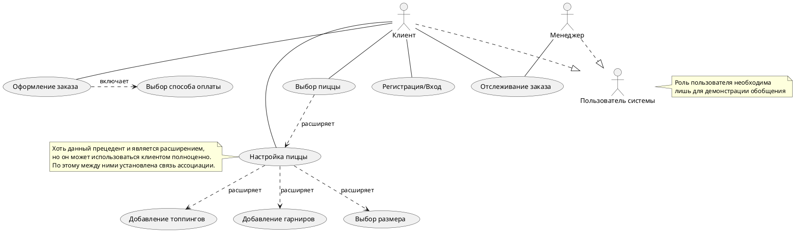
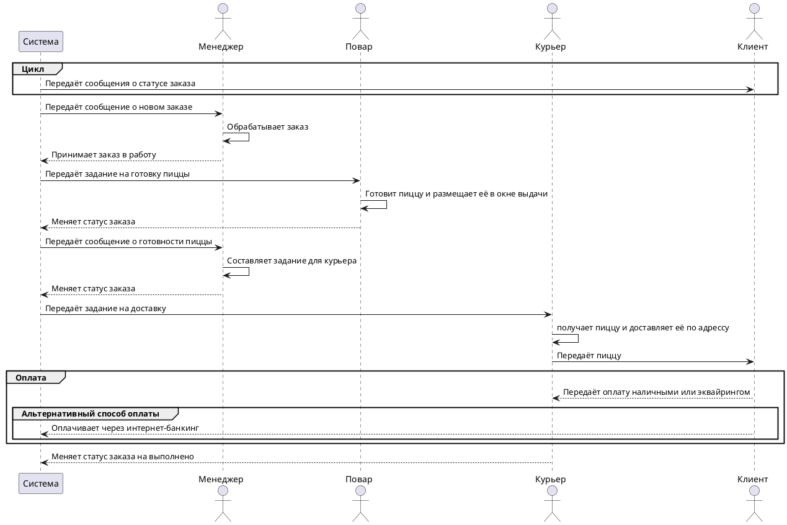
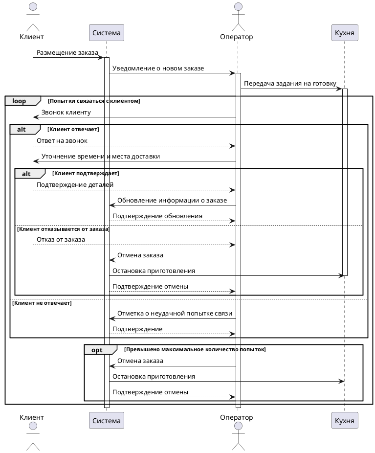
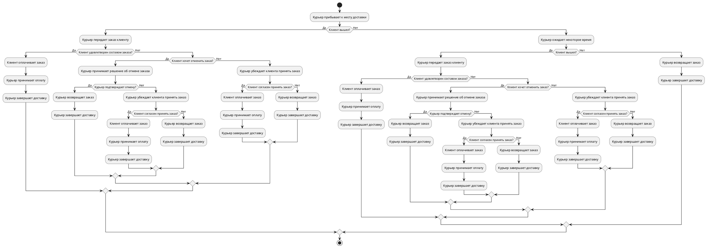

# Условие

Описать UC диаграммы, Сиквенc и активити для веб-приложения заказа пиццы  

Бизнес требования:  
Задокументировать требования как со стороны клиентов так и со стороны сотрудника пиццерии  
  
Функциональные требования:  
1.Описать диаграммами кейс заказа пиццы и выбора компонентов заказчиком  
2.Описать кейс передачи заказа от оператора пиццерии к повару(считаем что любые ингредиенты есть, т.е. повар при получении берет в работу сразу)  
3.Описать кейс согласования заказа оператором с клиентом время и места получения заказа(считаем что заказ начинает готовиться сразу после поступления от клиента)  
4.Описать кейс получения оплаты курьером и передачи заказа, предусмотреть возможность что клиент не вышел, он не удовлетворен составом заказа и хочет произвести отмену(для упрощения, решение об подтверждении отмены принимает сам курьер, звонить в пиццерию не нужно)  
  
Для каждого пункта достаточно одной диаграммы, можно больше - но это по желанию и по вашему времени.  
НО, обязательно чтобы все три вида диаграмм были сделаны ( пример 2 UC один сиквенс и один активити)

---

# Бизнес-требования

Предположим, что бизнес заказчика простая, но популярная пиццерия в условном городе, которая долгое время работала по классической схеме без использования информационных систем. Заказы оформлялись и выдавались непосредственно на месте. Время и стандарты конкурентов диктуют бизнесу необходимость в применении в своих бизнес-процессах информационных систем. В соответствии с этим можно предположить такие бизнес требования:

Требования клиента
- Клиент желает оформить и оплатить заказ удалённо;
- Клиент желает получить заказ с доставкой.

Требования пользователя
- Владелец бизнеса желает остановить падения количества заказов в день и выйти на средний показатель заказов предыдущего года к концу этого; 
- Владелец бизнеса желает сократить суммарную нагрузку на одного менеджера на один рабочий час в день.
- Менеджер и повар желает упорядочить и систематизировать получаемые заказы для снижения ошибок в выполнении заказов на один процент в день.

---

# Примечании

Изображения диаграмм представлены в формате .svg их можно открыть в отдельной вкладке браузера для масштабирования. 

---

# 1. Диаграмма заказа пиццы и выбора компонентов

Для данного кейса будет использоваться диаграмма вариантов использования. 

![[4.svg]]

---
# 2. Диаграмма передачи заказа от оператора повару

Для данной кейса будет использоваться диаграмма последовательностей. Считаем что система достаточно автоматизирована и менеджер на прямую не взаимодействует с поваром.

![[5.svg]]

---
# 3. Диаграмма согласование заказа оператором с клиентом время и места получения заказа

![[6.svg]]

---
# 4. Диаграмма получения оплаты курьером и передачи заказа

Для описания данного кейса будет использоваться диаграмма деятельности.

![[7.svg]]
