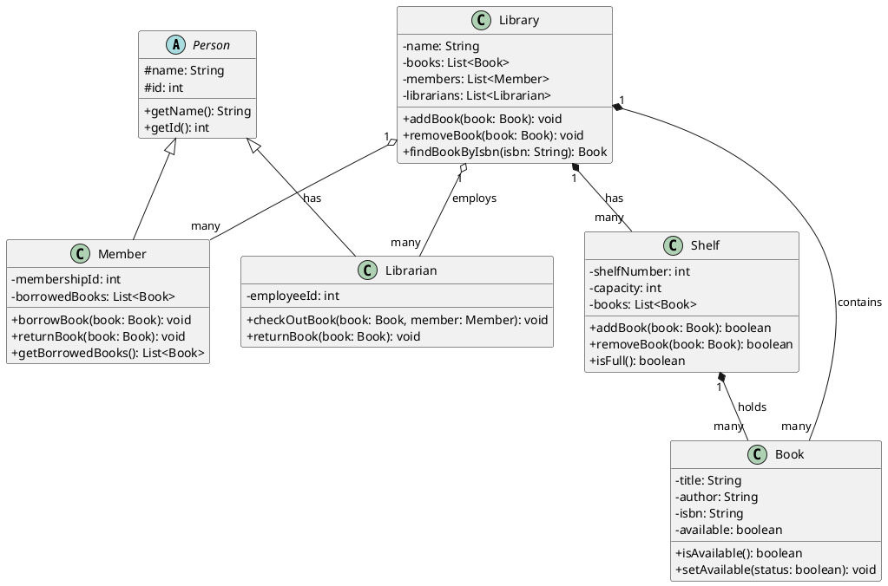
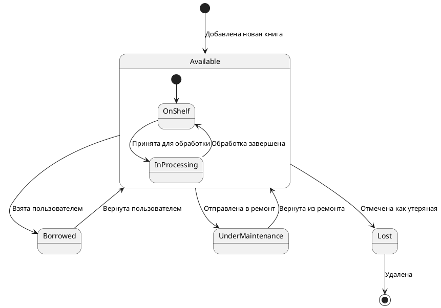

# Условие

1. Постройте диаграмму классов по одной из предложенных предметных областей, или предметная область на ваш выбор:  
	- Обязательно использование на диаграмме таких видов отношений, как ассоциация, наследование, агрегация (минимум 1), композиция (минимум 1);  
	- Количество методов в классе от 1-4(можно больше при необходимости, но не один метод на один класс);  
	- Атрибуты должны содержать: Видимость, Наименование и Тип данных;  
	- Количество классов не меньше 5.  
2. Постройте диаграмму состояний для жизненного цикла одного из объектов выбранной вами предметной области. 

---
# 1. Диаграмма классов

В качестве предметной области будет выбрана **библиотека**. Рассмотрим основные сущности и отношения между ними. Затем создадим диаграмму классов и диаграмму состояний с использованием PlantUML.

Диаграмма классов включает:

- Наследование: Librarian и Member наследуются от абстрактного класса Person.
- Ассоциация: между Library и Member, Library и Librarian.
- Композиция: между Library и Book, Library и Shelf.
- Агрегация: между Library и Member, Library и Librarian.

---
# 2. Диаграмму состояний 

Эта диаграмма состояний будет показывать жизненный цикл книги в библиотеке:

1. Начальное состояние: Новая книга добавляется в библиотеку и сразу становится доступной (Available).
2. Основные состояния:
    - Available (Доступна): Книга находится в библиотеке и может быть выдана.
    - Borrowed (Выдана): Книга выдана члену библиотеки.
    - UnderMaintenance (На обслуживании): Книга отправлена на ремонт или обслуживание.
    - Lost (Утеряна): Книга помечена как утерянная.
3. Подсостояния для Available:
    - OnShelf (На полке): Книга находится на полке и готова к выдаче.
    - InProcessing (В обработке): Книга временно снята с полки для обработки (например, для проверки состояния, обновления информации и т.д.).
4. Переходы:
    - Available -> Borrowed: Книга выдается члену библиотеки.
    - Borrowed -> Available: Книга возвращается в библиотеку.
    - Available -> UnderMaintenance: Книга отправляется на ремонт.
    - UnderMaintenance -> Available: Ремонт завершен, книга возвращается в доступное состояние.
    - Available -> Lost: Книга помечается как утерянная.
    - Lost -> (конечное состояние): Утерянная книга удаляется из системы библиотеки.
5. Переходы внутри состояния Available:
    - OnShelf -> InProcessing: Книга берется с полки для обработки.
    - InProcessing -> OnShelf: Обработка завершена, книга возвращается на полку.

Эта диаграмма состояний хорошо отражает жизненный цикл книги в библиотеке и согласуется с предоставленной диаграммой классов. Она показывает различные состояния, в которых может находиться книга, и возможные переходы между этими состояниями.

Эти диаграммы дают общее представление о структуре и поведении объектов в системе библиотеки.

