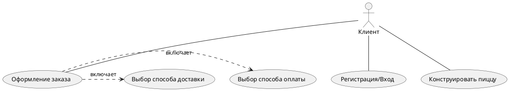

# Условие

Разработать прототип для **веб-приложения**  

**Бизнес требования:**  
Увеличить продажи пиццы за счет возможности заказа комбинированной пиццы с помощью конструктора пиццы на сайте.  

**Функциональные требования**:  
1.Клиент должен иметь возможность собрать индивидуальную пиццу, комбинируя различные  
элементы (кусочки пиццы) из базовых рецептов.  
2.Финальная пицца должна состоять из кусочков по не более чем 3м базовым рецептам в равной пропорции  
3.Клиенту должен быть доступен список базовых рецептов с картинками, а так же изображение финальной комбо-пиццы  
4.После формирования финальной пиццы Клиент должен иметь возможность перейти на страницу оплаты заказа  

Программа **минимум (Робин)**:  
1.Подготовить wireframe’ы экрана(ов) для описанного приложения  
2.Составить таблицу элементов приложения (если описаны поля – указать тип поля и ограничения)  
  
Программа **максимум (Бетмен)**:  в дополнении к заданиям **Робин**  
1.Подготовить мокап (wireframe можно не делать, мокап можно кликабельный.)  
2.Описать варианты использования

---
# Бизнес заказчика.

В соответствии с домашним заданием к лекции 3 напомним, что обозначенный бизнес не имеет 

---
# Замечание к заданию

Требование "Финальная пицца должна состоять из кусочков по не более чем 3м базовым рецептам в равной пропорции" на практике не осуществимо, т.к. классическая пицца состоит из 8 кусочков - **чётного значения**, т.к. как ограничение в три базовых рецепта - **нечётное**.  При выборе трёх вариантов не возможно собрать классическую пиццу в равной пропорции. При выполнении реального проекта это требования следует пересмотреть.

Прошу принять во внимание, что разработка прототипа происходила с дифицитом свободного времени. Многие представленные элементы спорны в своём решении и должны быть переработаны при разработке рабочего решения.  

---
# Прототип

## 1. Главный экран

## 2. Экран конструктора

## 3. Экран выбора способа оплаты

---
# Таблица элементов

| Название                                  | Фото        | Описание                                                                                                                                                                                                                                                                                                                                                                                                                                   |
| ----------------------------------------- | ----------- | ------------------------------------------------------------------------------------------------------------------------------------------------------------------------------------------------------------------------------------------------------------------------------------------------------------------------------------------------------------------------------------------------------------------------------------------ |
| **1. Главный Экран**                      |             |                                                                                                                                                                                                                                                                                                                                                                                                                                            |
| Логотип                                   |   | Логотип фирмы клиента. При нажатии возвращает на главный экран.                                                                                                                                                                                                                                                                                                                                                                            |
| Кнопка доставки                           |   | Интерактивная кнопка. При нажатии отображает форму оформления заказа. Отображает выбранный адрес доставки и количество продуктов в корзине                                                                                                                                                                                                                                                                                                 |
| Кнопка входа                              |   | Интерактивная кнопка. Открывает форму авторизации. Если пользователь авторизирован, то отображает профиль пользователя.                                                                                                                                                                                                                                                                                                                    |
| Кнопка "Собрать Вкуснятину"               |   | Кнопка, открывающая форму конструктора пиццы.                                                                                                                                                                                                                                                                                                                                                                                              |
| Кнопка "Подробнее"                        |   | Кнопка, открывающая форму с прочей информацией. О доставке, об юридической информации, оферте и т.д.                                                                                                                                                                                                                                                                                                                                       |
| **2. Экран конструктора **                |             |                                                                                                                                                                                                                                                                                                                                                                                                                                            |
| Кнопка фильта                             |   | Открывает выпадающее меню с различными настройками фильтров и поиском.                                                                                                                                                                                                                                                                                                                                                                     |
| Представление листа пицц.                 |  | Отображает базовые рецепты из которых можно сконструировать пиццу. Выбранные рецепты подсвечиваются зелёным. При выборе отображается счётчик цены и доступных "кусочков", которые можно добавить в пиццу. Если пицца полностью сконструирована, то часть рецептов блокируется к выбору и подсвечивается серым цветом. Рецепты интерактивным. Рассчитывается цена. Через кнопку информации можно получить более подробное описание рецепта. |
| Отображение конструктора                  |  | Интерактивный элемент. Отображает примерный вид будущей пиццы. В реальном времени "заполняется" выбранными кусочками пиццы. На прототипе представлен цельной пиццей из-за отсутствия подходящего референса. Отображает полную стоимость и счётчик кусочков.                                                                                                                                                                                |
| Кнопка "Оформить"                         |  | Интерактивная кнопка. Нажатие отображает форму оформления доставки. Становится активной только когда пицца полностью "собрана".                                                                                                                                                                                                                                                                                                            |
| **3. Экран выбора способа оплаты**        |             |                                                                                                                                                                                                                                                                                                                                                                                                                                            |
| Кнопки выбора способов доставки и оплаты. |  | Радиобаттаны. При нажатии "Курьер" откроется форма для указания адреса и времени доставки. При выборе способа оплаты онлайн при нажатии кнопки "заказать" откроется форма оплаты.                                                                                                                                                                                                                                                          |
| Представление листа заказа                |  | Список выбранных товаров к заказу.                                                                                                                                                                                                                                                                                                                                                                                                         |
| Кнопка "Заказать".                        |  | Нажатие оформляет заказ.                                                                                                                                                                                                                                                                                                                                                                                                                   |
| Кнопка "Продолжить выбор"                 |  | Возвращает на форму конструктора для конструирования новой пиццы.                                                                                                                                                                                                                                                                                                                                                                          |

---
# Варианты использования

Описания вариантов использование представлено в виде диаграммы использования PlantUML. Представленные варианты использования включают только прецеденты представленные на прототипе.

