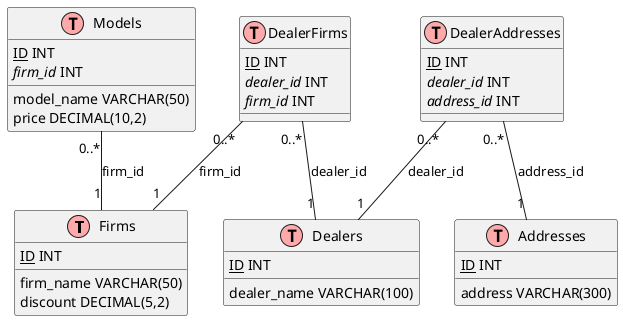

# Условие

| Фирма    | Модели          | Цена                 | Скидка | Дилер                         | Адрес                                                                                                |
| -------- | --------------- | -------------------- | ------ | ----------------------------- | ---------------------------------------------------------------------------------------------------- |
| BMW      | M5, X5M, M1     | 100000, 30000, 50000 | 3%     | Ирбис-авто, Рольф, АвтоГермес | г. Москва, ул. Тверская д.6; г. Москва Волгоградский проспект 107, к.3; г. Таганрог ул. Ленина д. 12 |
| Nissan   | GT-R            | 170000               | 5%     | КАН-авто, Рольф               | г. Казань, ул. Сибирский тракт д.55; г. Москва ул. Энтузиастов д.1                                   |
| Mercedes | G63, C180, E320 | 67000, 43000, 27000  | 4%     | Авилон                        | г. Мытищи ул. Светлая д.95                                                                           |

1. Нормализовать данные, до третьей нормальной формы 
2. При нормализации выделить справочник моделей автомобилей и справочник адресов( Справочник адресов можно разбить на несколько, например отдельно выделить справочник городов, на ваше усмотрение)  
3. Создать скрипты для создания объектов в БД, описать первичные ключи, внешние ключи, обязательность полей  
4. Написать SQL запрос на вывод всех автомобилей
5. Написать запрос на поиск самого дорогого автомобиля каждой марки  
6. Написать на ваше усмотрение триггер, check, индекс и т.д. (один на выбор)

# Выбор СУБД

Для тестового задание отличным вариантом будет использовать SQLite так как она не требует разворачивания громоздкой СУБД на ПК. 

# Проектирование

Исходя из представленного примера модель базы данных будет иметь следующий вид:




По данной диаграмме сформируем SQL - запросы на создание таблиц:

```sql
CREATE TABLE Firms (
    ID INTEGER PRIMARY KEY AUTOINCREMENT,
    firm_name VARCHAR(50) NOT NULL UNIQUE,
    discount DECIMAL(5,2) NOT NULL
);

CREATE TABLE Models (
    ID INTEGER PRIMARY KEY AUTOINCREMENT,
    firm_id INT NOT NULL,
    model_name VARCHAR(50) NOT NULL,
    price DECIMAL(10,2) NOT NULL,
    FOREIGN KEY (firm_id) REFERENCES Firms(ID),
    UNIQUE (firm_id, model_name)
);

CREATE TABLE Dealers (
    ID INTEGER PRIMARY KEY AUTOINCREMENT,
    dealer_name VARCHAR(100) NOT NULL UNIQUE
);

CREATE TABLE Addresses (
    ID INTEGER PRIMARY KEY AUTOINCREMENT,
    address VARCHAR(300) NOT NULL UNIQUE
);

CREATE TABLE DealerAddresses (
    ID INTEGER PRIMARY KEY AUTOINCREMENT,
    dealer_id INT NOT NULL,
    address_id INT NOT NULL,
    FOREIGN KEY (dealer_id) REFERENCES Dealers(ID),
    FOREIGN KEY (address_id) REFERENCES Addresses(ID),
    UNIQUE (dealer_id, address_id)
);

CREATE TABLE DealerFirms (
    ID INTEGER PRIMARY KEY AUTOINCREMENT,
    dealer_id INT NOT NULL,
    firm_id INT NOT NULL,
    FOREIGN KEY (dealer_id) REFERENCES Dealers(ID),
    FOREIGN KEY (firm_id) REFERENCES Firms(ID),
    UNIQUE (dealer_id, firm_id)
);
```

# Заполнение таблиц

Исходя из примера заполним таблицы данными следующими командами:

```sql
INSERT INTO Firms (firm_name, discount) VALUES
    ('BMW', 0.03),
    ('Nissan', 0.05),
    ('Mercedes', 0.04);

INSERT INTO Models (firm_id, model_name, price) VALUES
    (1, 'M5', 100000.00),
    (1, 'X5M', 30000.00),
    (1, 'M1', 50000.00),
    (2, 'GT-R', 170000.00),
    (3, 'G63', 67000.00),
    (3, 'C180', 43000.00),
    (3, 'E320', 27000.00);

INSERT INTO Dealers (dealer_name) VALUES
    ('Ирбис-авто'),
    ('Рольф'),
    ('АвтоГермес'),
    ('КАН-авто'),
    ('Авилон');

INSERT INTO Addresses (address) VALUES
    ('г. Москва, ул. Тверская д.6'),
    ('г. Москва Волгоградский проспект 107, к.3'),
    ('г. Таганрог ул. Ленина д. 12'),
    ('г. Казань, ул. Сибирский тракт д.55'),
    ('г. Москва ул. Энтузиастов д.1'),
    ('г. Мытищи ул. Светлая д.95');

INSERT INTO DealerAddresses (dealer_id, address_id) VALUES
    (1, 1),
    (1, 2),
    (3, 3),
    (2, 4),
    (2, 5),
    (5, 6);

INSERT INTO DealerFirms (dealer_id, firm_id) VALUES
    (1, 1),
    (2, 1),
    (3, 1),
    (2, 2),
    (4, 2),
    (5, 3);
```

# Вывод всех авто в соответствии с условием

```sql
SELECT 
  F.firm_name,
  GROUP_CONCAT(DISTINCT M.model_name) AS models,
  GROUP_CONCAT(DISTINCT M.price) AS prices,
  F.discount,
  GROUP_CONCAT(DISTINCT D.dealer_name) AS dealers,
  GROUP_CONCAT(DISTINCT A.address) AS addresses
FROM 
  Firms F
  LEFT JOIN Models M ON F.ID = M.firm_id
  LEFT JOIN DealerFirms DF ON F.ID = DF.firm_id
  LEFT JOIN Dealers D ON DF.dealer_id = D.ID
  LEFT JOIN DealerAddresses DA ON D.ID = DA.dealer_id
  LEFT JOIN Addresses A ON DA.address_id = A.ID
GROUP BY 
  F.firm_name, F.discount
ORDER BY 
  F.firm_name;
```

# Поиск самого дорогого автомобиля каждой марки

```sql
SELECT 
  F.firm_name, 
  M.model_name, 
  M.price
FROM 
  Firms F
  INNER JOIN Models M ON F.ID = M.firm_id
WHERE 
  (F.firm_name, M.price) IN (
    SELECT 
      F.firm_name, 
      MAX(M.price)
    FROM 
      Firms F
      INNER JOIN Models M ON F.ID = M.firm_id
    GROUP BY 
      F.firm_name
  )
ORDER BY 
  F.firm_name;
```

# Примеры триггера, проверки и индекса

Этот триггер проверяет, является ли значение скидки между 0 и 1 перед обновлением скидки фирмы. Если значение вне диапазона, он генерирует ошибку.

```sql
CREATE TRIGGER update_discount
BEFORE UPDATE ON Firms
FOR EACH ROW
BEGIN
    IF NEW.discount < 0 OR NEW.discount > 1 THEN
        SIGNAL SQLSTATE '45000' SET MESSAGE_TEXT = 'Скидка должна быть между 0 и 1';
    END IF;
END;
```

Эта проверка обеспечивает то, что цена модели всегда больше 0.

```sql
ALTER TABLE Models
ADD CONSTRAINT price_check
CHECK (price > 0);
```

Этот индекс создает B-дерево индекс на столбец `firm_name` таблицы `Firms`, что может улучшить производительность запросов при поиске фирм по имени.

```sql
CREATE INDEX idx_firm_name ON Firms (firm_name);
```

